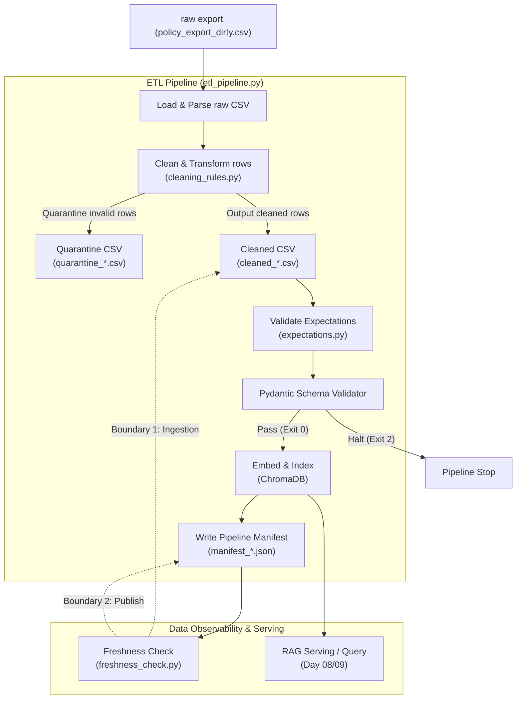

# Kiến trúc pipeline — Lab Day 10

**Nhóm:** CS_IT_Helpdesk_Data_Team  
**Cập nhật:** 2026-06-10

---

## 1. Sơ đồ luồng (Data Flow Diagram)

Dưới đây là sơ đồ Mermaid mô tả luồng dữ liệu từ nguồn (raw export) qua quá trình làm sạch (cleaning), xác thực (validation), nạp (embedding) và kiểm tra freshness ở hai boundary:

---

## 2. Ranh giới trách nhiệm

| Thành phần | Input | Output | Owner nhóm |
|------------|-------|--------|--------------|
| **Ingestion** | `data/raw/policy_export_dirty.csv` | List[Dict[str, str]] (parsed rows) + Ingest Logs | Ingestion Owner |
| **Transform** | Raw rows (List[Dict]) | Cleaned rows + Quarantine rows (List[Dict]) | Cleaning & Quality Owner |
| **Quality** | Cleaned rows (List[Dict]) | `ExpectationResult`s + Pydantic validation status (Pass/Fail) | Cleaning & Quality Owner |
| **Embed** | Cleaned CSV | Upserted Chroma DB Collection + Pruned old vector IDs | Embed Owner |
| **Monitor** | Pipeline Manifest | SLA Freshness status (PASS/WARN/FAIL) cho 2 boundary | Monitoring / Docs Owner |

---

## 3. Idempotency & rerun

- **Chiến lược:** Pipeline sử dụng cơ chế **Upsert** dựa trên `chunk_id` ổn định. `chunk_id` được tạo thông qua hash SHA-256 từ sự kết hợp của `doc_id`, `chunk_text`, và số thứ tự `seq` (`_stable_chunk_id`).
- **Pruning (Dọn dẹp):** Để tránh "mồi cũ" hay các vector lạc hậu của các run trước làm nhiễu kết quả, trước khi nạp dữ liệu mới, pipeline tự động lấy toàn bộ danh sách `ids` hiện có trong collection, so sánh với `ids` của run hiện tại, và xóa các ID không còn tồn tại trong tập dữ liệu sạch (`col.delete(ids=drop)`).
- **Rerun:** Rerun nhiều lần không làm tăng kích thước tài nguyên hay trùng lặp dữ liệu trong vector database.

---

## 4. Liên hệ Day 09

- Pipeline này cung cấp một corpus sạch và chuẩn hóa nhất cho vector database phục vụ Chatbot/RAG của Day 09.
- Bằng cách chuẩn hóa dữ liệu trước khi nạp (loại bỏ version HR 2025 cũ, cập nhật refund window thành 7 ngày, thêm context enrichment làm tiền tố), Agent ở Day 09 sẽ truy xuất đúng context chất lượng nhất mà không bị mâu thuẫn thông tin (version conflict).

---

## 5. Rủi Ro Đã Biết (Known Risks)

1. **Sai lệch đồng hồ hệ thống (Clock Skew):** Ảnh hưởng đến việc tính toán khoảng thời gian trễ của dữ liệu (freshness ages).
2. **Lỗi mạng khi download mô hình:** SentenceTransformers cần kết nối internet ở lần chạy đầu tiên để tải model `all-MiniLM-L6-v2`.
3. **Mâu thuẫn logic trong dữ liệu nguồn:** Nếu dữ liệu nguồn thô có mâu thuẫn nghiêm trọng nhưng không vi phạm schema hay các rules đã khai báo, pipeline có thể để lọt dữ liệu bẩn vào vector DB.
